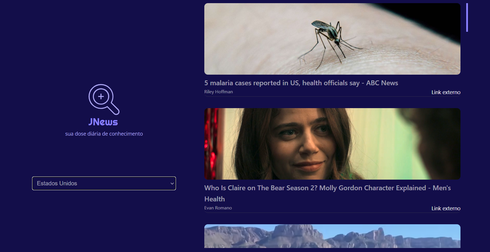
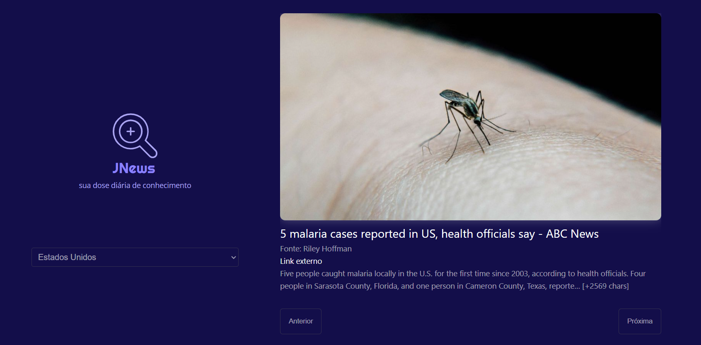
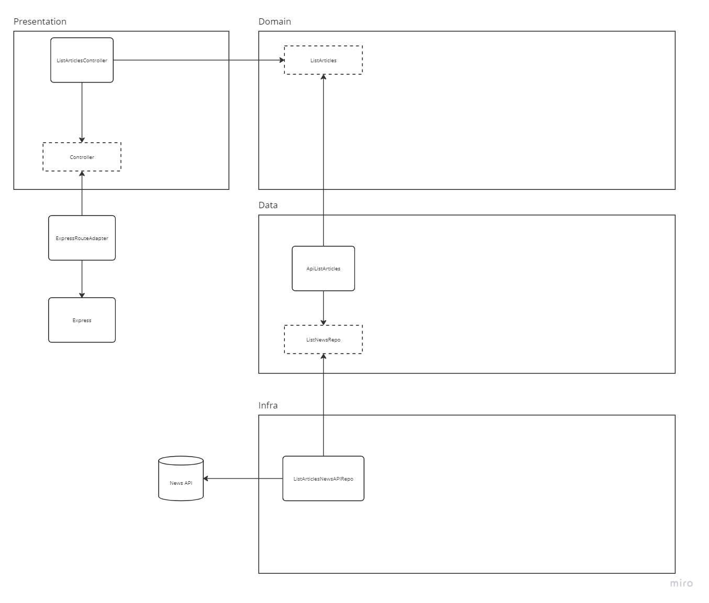

# Projeto Full Stack de Consulta a API News https://newsapi.org/

## Como executar
- `docker compose up`

### Após executar com o Docker-compose, os seguintes Endpoints estarão disponíveis:
- API: http://localhost:3001
- FRONT: http://localhost:8080
- Articles API: http://localhost:3001/api/articles

### Caso não queira executar o docker, a aplicação está publicada na Vercel (front) + Render (api)
- Front: https://jnews.vercel.app
- API: https://jnews.onrender.com

Foram aplicados conceitos de Clean Architeture, Clean Code, e alguns Design Patterns como Adapter e Factories.
As camadas da aplicação estão desacopladas uma das outras, dessa forma fica fácil trocar do Express para outro Framework, bastando criar um Adpater para esse Framework.

Inicialmente foi planejado salvar os artigos consultados na API em um armazenamento interno da API para melhoria de performance, mas optei por deixar para um segundo momento.

O Front End foi desenvolvido em Vue Js 3 consumindo a API Express.

# Screenshots
  

Nessa aplicação é possível consultar as notícias mais recentes da News API separado por países, é possível percorrer entre a próxima e a anterior.

Abaixo um diagrama da estruturação da API Express

